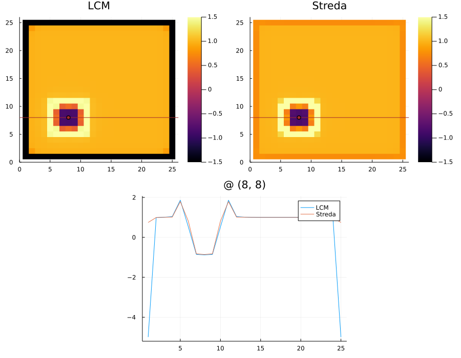

# TopologicalMarkers

A package that simplifies calculation of different topological markers.

```julia
m_lattice = ones(25, 25)
m_lattice[6:10, 6:10] .= -1
H = hamiltonian(m_lattice, :c)
P = filled_projector(H)
X, Y = coord_operators()
ch = -4π * im * P * X * P * Y * P

B = 0.01
Hb = hamiltonian(m_lattice, :c, field=@landau(B))
Pb = filled_projector(Hb)
str = (Pb - P) / B

plot_auto("LCM" => ch, "Streda" => str, 
    hmapclims=(-1.5, 1.5), currentscolor=:yellow, control_site=(8, 8), markercolor=:brown)
```

The code here woll produce the following graph:

